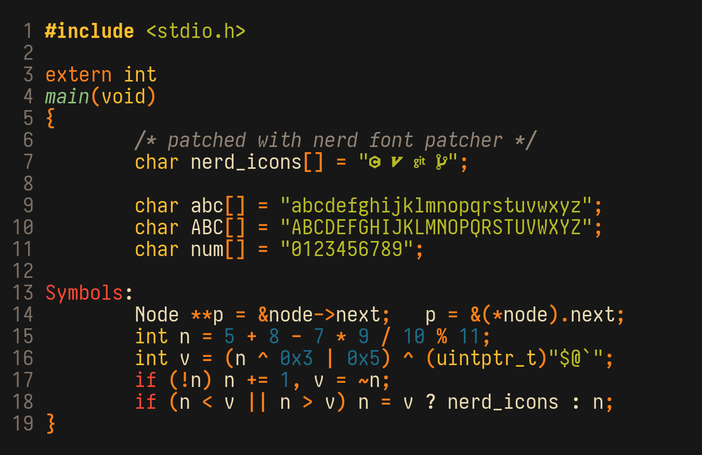

# Iosvmata

***You can download the ttf files from the [releases tab][rel]
(grab the `.tar.zst` file).***

### What, Why, How?

If you're like clean, "upright" looking fonts, then the chances are that you've
come across [Iosevka][]. You've probably also come across [PragmataPro][].

Both of these fonts are great in their own right but they both suffer from one
fatal flaw - they're way too condensed for me to use for prolonged period of
time without eye strain.

The good news is that Iosevka provides an "Extended" variant which has wider
spacing. However it's a bit *too* wide, which takes away from the slender feel
of Iosevka.

Iosevka however, isn't just a font family. It's more or less a full framework
where you can pick and choose and customize just about everything. And so that's
precisely what I did.

The Iosvmata config is based on [Pragmasevka][], which tries to mimic
PragmataPro as much as possible. The main goal of `Iosvmata` is to take things I
like from Iosevka and PragmataPro but patch out things I don't like. Some
notable changes (not exhaustive, see `Iosvmata.toml` for a full config):

* Use a width of `550` which is just extended enough to not strain my eyes but
  not *too* extended so that it takes away the condensed feel of
  Iosevka/PragmataPro. (For reference, Iosevka Extended uses 600 and Pragmasevka
  uses 500).
* Uses the regular slashed 0.
* Capital `J` has bar on top.
* Uses the more "sharp" looking braces.
* No ligatures.
* A lot more non-alphanumeric characters are boldened compared to Pragmasevka
  (see `bolder.py`).

[Iosevka]: https://typeof.net/Iosevka
[PragmataPro]: https://fsd.it/shop/fonts/pragmatapro/
[Pragmasevka]: https://github.com/shytikov/pragmasevka
[rel]: https://github.com/N-R-K/Iosvmata/releases

### Build Instruction

1. Follow [these instructions][ios-build] to build the font out of
   `Iosvmata.toml` config.
2. Run the `bolder.py` script.
3. Optionally patch the final font with [Nerd-Font-Patcher][NFP]
   (search for `FontPatcher.zip`).

[ios-build]: https://github.com/be5invis/Iosevka/blob/main/doc/custom-build.md
[NFP]: https://github.com/ryanoasis/nerd-fonts/releases/latest

### Thanks to

* [Pragmasevka][]: This project is pretty much a fork of Pragmasevka. So massive
  thanks to it for laying the groundwork.

## How to extract `.tar.zst`

#### Linux/BSD/macos

0. Install the `zstd` package (if you don't have it installed already).
1. Run `tar -I zstd -xf Iosvmata.tar.zst`.

#### Windows

If you want a GUI then [7-zip-zstd](https://github.com/mcmilk/7-Zip-zstd)
(`.exe` download [here](https://github.com/mcmilk/7-Zip-zstd/releases)) seems to
be the recommended tool.

If you are comfortable with command-line, `zstd` provides official [builds for
windows](https://github.com/facebook/zstd/releases/) including a `zstd.exe`.
